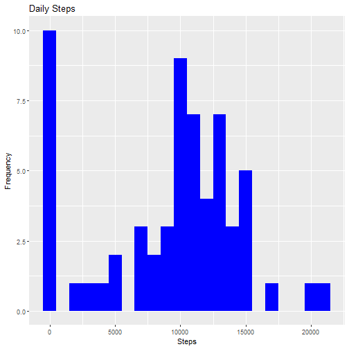

 
## Loading and processing the data
##### 1. Load the data 


```r
library(data.table)
library(ggplot2)

fileUrl <- "https://d396qusza40orc.cloudfront.net/repdata%2Fdata%2Factivity.zip"
download.file(fileUrl, destfile = paste0(getwd(), '/repdata%2Fdata%2Factivity.zip'), method = "curl")
unzip("repdata%2Fdata%2Factivity.zip",exdir = "data")
```


```r
activity_data <- data.table::fread(input = "data/activity.csv")
```

##What is mean total number of steps taken per day?
###1.Calculate the total number of steps taken per day


```r
Total_Steps <- activity_data[, c(lapply(.SD, sum, na.rm = FALSE)), .SDcols = c("steps"), by = .(date)] 

head(Total_Steps, 10)
```

```
##           date steps
##  1: 2012-10-01    NA
##  2: 2012-10-02   126
##  3: 2012-10-03 11352
##  4: 2012-10-04 12116
##  5: 2012-10-05 13294
##  6: 2012-10-06 15420
##  7: 2012-10-07 11015
##  8: 2012-10-08    NA
##  9: 2012-10-09 12811
## 10: 2012-10-10  9900
```

### 1. Histogram of the total number of steps taken each day


```r
ggplot(Total_Steps, aes(x = steps)) +
    geom_histogram(fill = "blue", binwidth = 1000) +
    labs(title = "Daily Steps", x = "Steps", y = "Frequency")
```

```
## Warning: Removed 8 rows containing non-finite values (stat_bin).
```


### 2. Mean and median total number of steps taken per day


```r
Total_Steps[, .(Mean_Steps = mean(steps, na.rm = TRUE), Median_Steps = median(steps, na.rm = TRUE))]
```

```
##    Mean_Steps Median_Steps
## 1:   10766.19        10765
```

-----

## What is the average daily activity pattern?


```r
IntervalDT <- activity_data[, c(lapply(.SD, mean, na.rm = TRUE)), .SDcols = c("steps"), by = .(interval)] 

ggplot(IntervalDT, aes(x = interval , y = steps)) + geom_line(color="blue", size=1) + labs(title = "Avg. Daily Steps", x = "Interval", y = "Avg. Steps per day")
```


### 5-minute interval, on average across all the days in the dataset, contains the maximum number of steps


```r
IntervalDT[steps == max(steps), .(max_interval = interval)]
```

```
##    max_interval
## 1:          835
```

----

## Imputing missing values
### 1. The total number of missing values in the dataset 


```r
activity_data[is.na(steps), .N ]
```

```
## [1] 2304
```

### 2. Devise a strategy for filling in all of the missing values in the dataset.
### 3. Create a new dataset that is equal to the original dataset but with the missing data filled in.


```r
activity_data[is.na(steps), "steps"] <- activity_data[, c(lapply(.SD, median, na.rm = TRUE)), .SDcols = c("steps")]
```


##### 4. Histogram of the total number of steps taken each day 


```r
Total_Steps <- activity_data[, c(lapply(.SD, sum)), .SDcols = c("steps"), by = .(date)] 
ggplot(Total_Steps, aes(x = steps)) + geom_histogram(fill = "blue", binwidth = 1000) + labs(title = "Daily Steps", x = "Steps", y = "Frequency")
```




 

##### ... and Calculate and report the mean and median total number of steps taken per day. 


```r
Total_Steps[, .(Mean_Steps = mean(steps), Median_Steps = median(steps))]
```

```
##    Mean_Steps Median_Steps
## 1:    9354.23        10395
```


----

## Are there differences in activity patterns between weekdays and weekends?
## 1. Create a new factor variable in the dataset with two levels for Weekday or Weekend


```r
activity_data$dateType <-  ifelse(as.POSIXlt(activity_data$date)$wday %in% c(0,6), 'weekend', 'weekday')
head(activity_data, 10)
```

```
##     steps       date interval dateType
##  1:     0 2012-10-01        0  weekday
##  2:     0 2012-10-01        5  weekday
##  3:     0 2012-10-01       10  weekday
##  4:     0 2012-10-01       15  weekday
##  5:     0 2012-10-01       20  weekday
##  6:     0 2012-10-01       25  weekday
##  7:     0 2012-10-01       30  weekday
##  8:     0 2012-10-01       35  weekday
##  9:     0 2012-10-01       40  weekday
## 10:     0 2012-10-01       45  weekday
```

## 2. Panel plot containing a time series plot


```r
activity_data[is.na(steps), "steps"] <- activity_data[, c(lapply(.SD, median, na.rm = TRUE)), .SDcols = c("steps")]
IntervalDT <- activity_data[, c(lapply(.SD, mean, na.rm = TRUE)), .SDcols = c("steps"), by = .(interval, `dateType`)] 

ggplot(IntervalDT , aes(x = interval , y = steps, color=`dateType`)) + geom_line() + labs(title = "Avg. Daily Steps by Weektype", x = "Interval", y = "No. of Steps") + facet_wrap(~`dateType` , ncol = 1, nrow=2)
```


